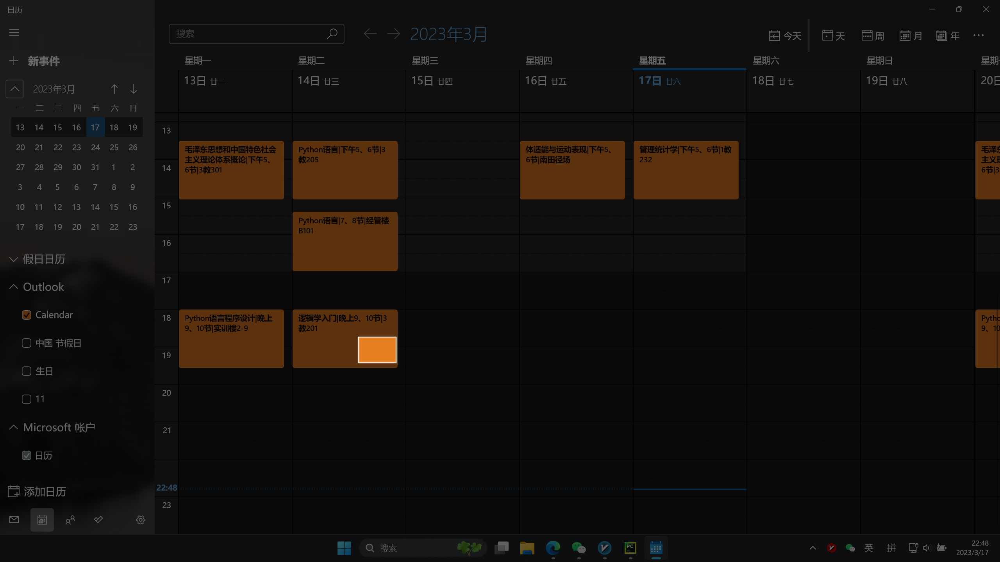
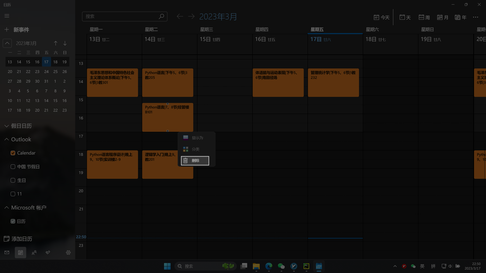
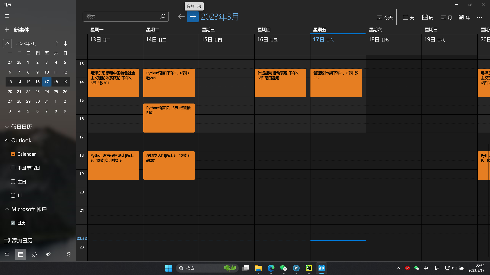

Manual removal of calendar schedules via pyautogui
====
 
### Demand Analysis
 
### preparation work

 
Using python to convert the curriculum into calendar csi files, but directly open csi files with win10/win11 will have bugs, that the schedule will be an hour earlier.  
However, the local calendar cannot be deleted in bulk.   
So I use pyautogui module to simulate manual deletion. 
 
This code depends on the **PyAutoGui** module, please install through the `pip install PyAutoGui`
 

Adjust the calendar to display by week  

use win + shift + s to capture the background color of the schedule ( may in C:\Users\Administrator\Pictures\Screenshots,**small screenshots is better**,considering that some schedule text is too much, so there is not enough bg_color for identification.   

  
  

Rename the image to ' color.png ' in the same directory as the program file.   

Then screenshot schedule delete button, named 'delete.png ' in the same directory

### How to use
First pop the window prompt to open the calendar, open the calendar program and click on the confirmation. 
Then click on the location entry prompt, place the mouse on the next week button, after the location is obtained, there is a pop-up prompt, click OK.   

The third step is to adjust to the first week of the schedule to be deleted, and click OK after entering the number of weeks.   

Wait for the end of the prompt  
