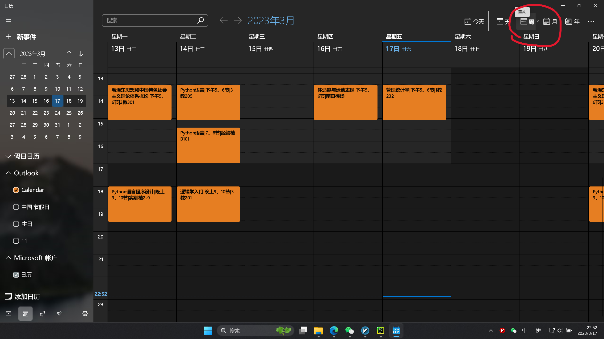
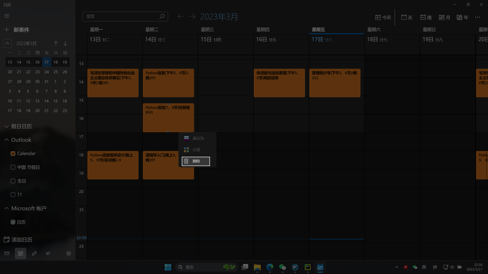

通过pyautogui实现日历日程手动清除
=======

##### 需求分析

使用python将课程表转化为日历csi文件，但是win10，win11直接打开csi文件会有bug（时区？），日程时间会提前一个小时。但是本地日历无法批量删除。  
于是我使用pyautogui模块，模拟手动删除。  
  
##### 准备工作  

本代码依赖 **PyAutoGui** 模块，请通过`pip install PyAutoGui`指令安装。  
1. 下载win11_canlendar_delete.py
1. 将日历调成按周显示week
  

1. 首先使用win+shift+s截取日程背景颜色（win11截图自动保存在C:\Users\Administrator\Pictures\Screenshots）， **截图要小** ，考虑到一些日程文字过多，没有足够大小的颜色快供识别。

1. 将图片重命名为`color.png`与程序文件放在同一目录下。 

1. 然后截屏日程的删除按钮，命名为`delete.png`放在同一目录下 

##### 运行程序

1. 首先弹窗提示打开日历，打开日历程序后点击确认。  
2. 然后点击位置录入提示，将鼠标放在下一周按钮上，在位置获取结束后，有弹窗提示，点击ok。 

3. 第三步调整到待删除日程的第一周，输入周数后点击ok。  
4. 等待提示结束  

>  **_PS：_**   
> 对于csi导入，可以使用手机outlook邮件打开csi，导入日历，然后同步到windows  
> 对于新建日历，似乎outlook客户端只能新建兴趣日历，但是outlook网页端有新建日历选项